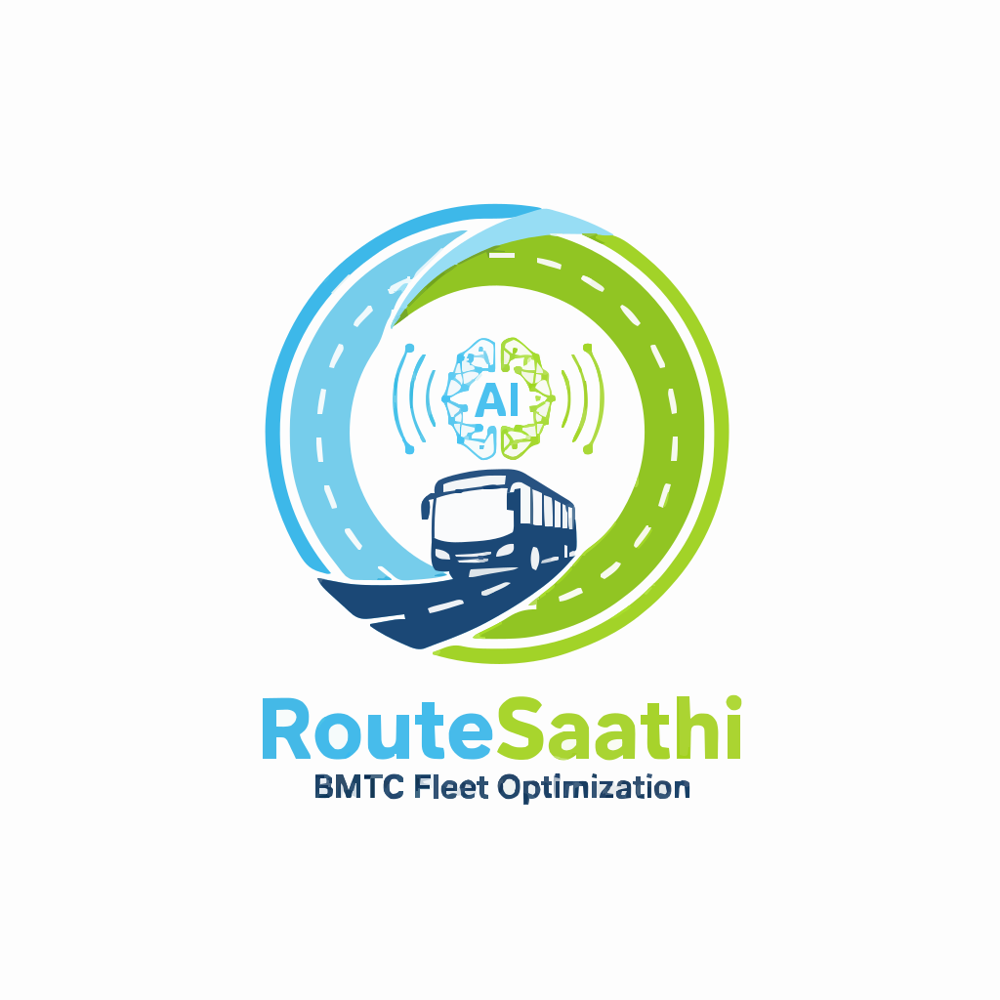

# RouteSaathi 2.0 - AI-Driven Fleet Management System

RouteSaathi 2.0 is a comprehensive, AI-powered fleet management solution designed for the Bengaluru Metropolitan Transport Corporation (BMTC). It optimizes public transport operations by providing real-time tracking, ML-based demand forecasting, and role-specific interfaces for Coordinators, Conductors, and Passengers.




## 🚀 Key Features

### 1. Coordinator Control Center
- **Live Fleet Tracking**: Real-time map view of all active buses using GPS simulation.
- **AI Recommendations**: Machine learning-driven suggestions (Random Forest) for bus reallocation based on predicted demand.
- **Analytics Dashboard**: Visual performance metrics using Recharts, including hourly demand trends and revenue analytics.
- **Multi-Language Support**: Full UI support for **English** and **Kannada** to ensure accessibility.
- **Broadcast System**: Send alerts and messages to conductors instantly.

### 2. Conductor App (Mobile First)
- **Digital Ticketing**: Issue tickets digitally with dynamic fare calculation and occupancy tracking.
- **Live Occupancy**: Real-time bus occupancy updates (Available, Moderate, Crowded).
- **Quick Actions**: One-tap reporting for SOS, Traffic, Breakdown, and Bus Full status.
- **Assignment View**: View daily route assignments and schedules.

### 3. Passenger App (Commuter)
- **Live Bus Tracking**: Track nearby buses on an interactive map with occupancy indicators.
- **Route Search**: Find buses between specific stops with estimated arrival times.
- **Digital Wallet**: Simulated wallet for ticket purchases.
- **SOS Safety**: Emergency alert system for passenger safety.

---

## 🛠️ Tech Stack

### Frontend
- **Framework**: React 18 (Vite)
- **Styling**: Tailwind CSS (Strict BMTC Red/Blue Branding)
- **Charts**: Recharts (Data Visualization)
- **i18n**: i18next (English & Kannada Support)
- **Maps**: React Leaflet & OpenStreetMap
- **Icons**: Lucide React

### Backend
- **Framework**: Python FastAPI
- **AI/ML**: Scikit-learn (Random Forest Regressor) for demand prediction
- **Data**: JSON-based persistent storage (NoSQL-style)
- **Server**: Uvicorn

---

## ⚙️ Installation & Setup

### 1. Clone the Repository
```bash
git clone https://github.com/IRX358/RouteSaathi-2.0?tab=readme-ov-file#-project-structure
cd RouteSaathi-2.0
```

### 2. Backend Setup
Navigate to the backend directory and install dependencies:
```bash
cd backend
pip install -r requirements.txt
```

### 3. Frontend Setup
Navigate to the frontend directory and install dependencies:
```bash
cd ../frontend
npm install
```

---

## 🏃‍♂️ Running the Application

### Start Backend Server
```bash
# In the backend directory
python -m uvicorn main:app --reload --port 8000
```
API Documentation (Swagger UI): `http://localhost:8000/docs`

### Start Frontend Server
```bash
# In the frontend directory
npm run dev
```
The application will be accessible at `http://localhost:5174`.

---

## 🔐 Demo Credentials

Refer to [CREDENTIALS.md](CREDENTIALS.md) for a full list of demo users.

| Role | Email | Password |
|------|-------|----------|
| **Coordinator** | `admin@bmtc.gov.in` | `admin123` |
| **Conductor** | `ganesh@bmtc.gov.in` | `conductor123` |
| **Passenger** | `user@gmail.com` | `user123` |

---

## 📂 Project Structure

```
RouteSaathi 2.0/
├── backend/
│   ├── data/               # JSON databases (users, buses, routes, tickets)
│   ├── models/             # Trained ML models (.joblib)
│   ├── routers/            # API endpoints (auth, buses, tickets, ai_engine)
│   ├── services/           # Business logic and data access layer
│   └── main.py             # Application entry point
│
├── frontend/
│   ├── src/
│   │   ├── assets/         # SVG logos and branding assets
│   │   ├── components/     # Reusable UI components (Layouts, Switchers)
│   │   ├── pages/          # Page views (Dashboard, Analytics, Tracking)
│   │   ├── services/       # API integration (Axios)
│   │   └── i18n.js         # Translation configuration
│   └── index.css           # Global styles and BMTC design system
│
└── README.md               # Project documentation
```

---

**© 2025 Bengaluru Metropolitan Transport Corporation (BMTC)**
